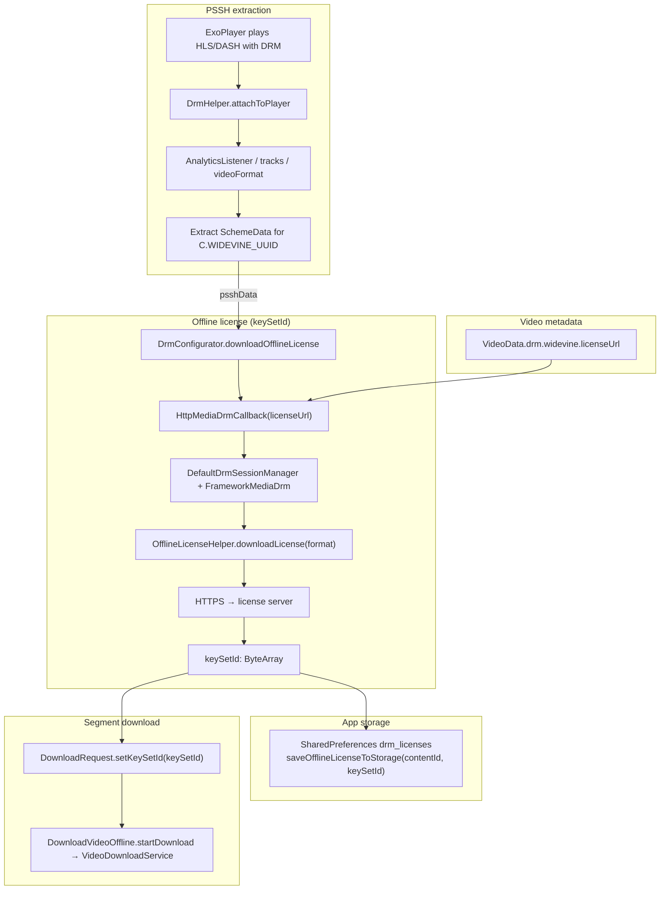
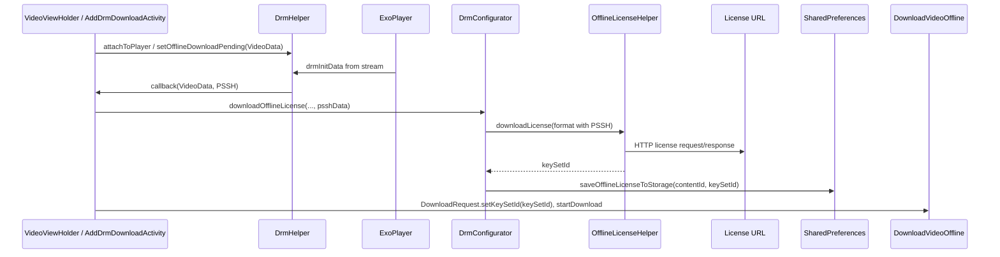

# kotlin-kinescope-player

[](https://jitpack.io/#kinescope/kotlin-kinescope-player)

Android SDK for [Kinescope](https://kinescope.io/) video: player, vertical Shorts feed, and offline downloads with DRM (Widevine) in a single dependency.

---
## Features

| Feature | Description |
|--------|-------------|
| **Player** | `KinescopeVideoPlayer`, `KinescopePlayerView` — HLS, DASH, Live, posters, player options, fullscreen, PiP, analytics |
| **Dashboard API** | `KinescopeApiHelper` — list/create/update/delete player templates via `api.kinescope.io` |
| **Shorts** | `io.kinescope.sdk.shorts` — TikTok-style vertical feed, `ViewPager2`, `KinescopeVideoProvider` for your API |
| **Offline** | `DownloadVideoOffline`, `VideoDownloadService` — HLS/DASH downloads, Widevine DRM, `DownloadManager` |
| **Demo app** | Stand APK and `app` module — try player, templates, Shorts, offline DRM before integration |

One dependency includes the player, Shorts, and the offline pipeline; `VideoDownloadService` and required permissions are merged from the library manifest.

---


## Demo app

A **stand/demo APK** is available to explore how the SDK works before integrating it into your project. The demo covers:

| Screen | What it shows |
|--------|----------------|
| **Playlist test** | Player with a video list |
| **Subtitles test** | Subtitles playback |
| **Custom UI test** | Player without built-in controls |
| **Custom Player test** | Player options, Dashboard API, player templates |
| **Live test** | Live stream mode |
| **Shorts** | Vertical feed |
| **Offline viewing** | DRM offline downloads and playback |

You can also build the demo from source — the `app` module in this repository.

**Before building or running the stand SDK**, set your Kinescope project API key in [`KinescopeDemoConfig`](app/src/main/java/io/kinescope/demo/KinescopeDemoConfig.kt):

```kotlin
object KinescopeDemoConfig {
    const val API_KEY = "your-api-key"
}
```

The key is used for the video catalog and player templates API (Playlist test, Custom Player test). Get it from your [Kinescope dashboard](https://kinescope.io/).

```bash
./gradlew :app:assembleDebug
```

The APK will be at `app/build/outputs/apk/debug/app-debug.apk`.

---


## Installation

**Step 1.** Add the JitPack repository to your build file.
Add it in your root `build.gradle`/`setting.gradle` file at the end of repositories:

```groovy
dependencyResolutionManagement {
   repositoriesMode.set(RepositoriesMode.FAIL_ON_PROJECT_REPOS)
   repositories {
      mavenCentral()
      maven { url 'https://jitpack.io' }
   }
}
```

**Step 2.** Add the dependency to your module's `build.gradle` file. Replace `<LATEST_VERSION>` with the current version (can be found in the JitPack badge at the top):

```groovy
dependencies {
   implementation 'com.github.kinescope:kotlin-kinescope-player:<LATEST_VERSION>'
}
```

---

## Quick start

### Player setup

1. Add `KinescopePlayerView` to your view's layout

```xml
<io.kinescope.sdk.view.KinescopePlayerView
   android:id="@+id/player_view"
   android:layout_width="match_parent"
   android:layout_height="250dp" />
```

2. Initialize `KinescopeVideoPlayer` with options (recommended):

```kotlin
import io.kinescope.sdk.models.players.syncLegacyChromeFlags
import io.kinescope.sdk.player.KinescopePlayerOptions
import io.kinescope.sdk.player.KinescopeVideoPlayer

val options = KinescopePlayerOptions().apply {
    accentColor = "#3B82F6"
    syncLegacyChromeFlags()
}
val kinescopePlayer = KinescopeVideoPlayer(context, options)
```

A no-options constructor is also available: `KinescopeVideoPlayer(context)`.

3. Attach the player to `KinescopePlayerView` and apply the template UI:

```kotlin
playerView.setPlayer(kinescopePlayer)
playerView.applyTemplateOptions()
```

4. Load and play video:

```kotlin
kinescopePlayer.loadVideo(videoId, onSuccess = { video ->
    if (!kinescopePlayer.kinescopePlayerOptions.autoplay) {
        kinescopePlayer.play()
    }
}, onFailed = {
    it?.printStackTrace()
})
```

When `autoplay = true` in options, playback starts automatically after `loadVideo` succeeds.

### Player options

`KinescopePlayerOptions` controls playback behaviour and player chrome. Main fields:

| Option | Default | Description |
|--------|---------|-------------|
| `autoplay` | `false` | Start playback after `loadVideo` |
| `muted` | `false` | Mute audio |
| `loop` | `false` | Loop current video |
| `controls` | `true` | Show player controls |
| `playsinline` | `true` | Inline playback (no forced fullscreen) |
| `preload` | `"metadata"` | Preload strategy: `none`, `metadata`, `auto` |
| `quality` | `"auto"` | Default quality: `auto`, `audio`, or height in px |
| `pictureInPicture` | `true` | Show PiP button (Android 8+) |
| `fullscreen` | `true` | Show fullscreen button |
| `playbackRate` | `true` | Show playback speed in settings |
| `accentColor` | `"#3B82F6"` | Accent colour for progress bar and initial play button |

> **Note.** At the moment, the Android SDK supports only the options listed above. If the Kinescope dashboard adds new player settings that are not yet implemented in the SDK, they are ignored when a template is fetched and applied on the device — that part of the template will not be reflected in the player UI or behaviour.

After changing options at runtime, call:

```kotlin
kinescopePlayer.applyPlaybackOptions()  // muted, loop on ExoPlayer
playerView.applyTemplateOptions()       // chrome, accent colour, default quality
```

Or refresh chrome only:

```kotlin
playerView.refreshPlayerChrome()
```

### Dashboard REST API (player templates)

Use `KinescopeApiConfig.createApiHelper` to access `api.kinescope.io`. Pass your project API key from the Kinescope dashboard.

```kotlin
import io.kinescope.sdk.api.KinescopeApiConfig
import io.kinescope.sdk.models.players.KinescopeCreatePlayerRequest
import io.kinescope.sdk.models.players.applyTo
import io.kinescope.sdk.models.players.toPlayerSettings
import kotlinx.coroutines.flow.catch
import kotlinx.coroutines.launch

// Application.onCreate
val apiHelper = KinescopeApiConfig.createApiHelper("your-api-key")

// List templates
lifecycleScope.launch {
    apiHelper.getPlayers()
        .catch { /* handle error */ }
        .collect { response ->
            val templates = response.data
        }
}

// Create template
val request = KinescopeCreatePlayerRequest(
    name = "My player",
    settings = kinescopePlayer.kinescopePlayerOptions.toPlayerSettings(),
)
apiHelper.createPlayer(request).collect { response ->
    val template = response.data
}

// Apply template settings to the player
template.settings?.applyTo(kinescopePlayer.kinescopePlayerOptions)
playerView.applyTemplateOptions()
```

Available methods on `KinescopeApiHelper`:

| Method | Endpoint |
|--------|----------|
| `getAllVideos()` | `GET /v1/videos/` |
| `getPlayers()` | `GET /v1/players` |
| `getPlayer(id)` | `GET /v1/players/{id}` |
| `createPlayer(request)` | `POST /v1/players` |
| `updatePlayer(id, request)` | `PUT /v1/players/{id}` |
| `deletePlayer(id)` | `DELETE /v1/players/{id}` |

Error helpers:

```kotlin
import io.kinescope.sdk.api.isDashboardPlayerDeleteRestriction
import io.kinescope.sdk.api.readApiErrorMessage

catch { error ->
    val message = error.readApiErrorMessage()
    val isDashboardRestriction = error.isDashboardPlayerDeleteRestriction()
}
```

#### HTTP response codes

| Code | Description | When it occurs |
|------|-------------|----------------|
| 200 | OK | Request completed successfully |
| 400 | Bad Request | Invalid request format or parameters |
| 401 | Unauthorized | Missing or invalid API token |
| 402 | Payment Required | Plan limits exceeded |
| 403 | Forbidden | No permission to perform the operation |
| 404 | Not Found | Resource not found |
| 422 | Unprocessable Entity | Data validation error |
| 429 | Too Many Requests | Rate limit exceeded |
| 500 | Internal Server Error | Server-side error |

#### API error codes

| Code | Name | Description |
|------|------|-------------|
| 1 | `IO_ERROR` | Empty request body |
| 100101 | `AUTH_HEADER_NOT_FOUND` | `Authorization` header is missing |
| 100102 | `UNAUTHORIZED` | Invalid token |
| 100103 | `ACCESS_DENIED` | Access denied |
| 100106 | `LIMIT_REACHED` | Limit reached |
| 400101 | `JSON_SYNTAX_ERROR` | JSON syntax error |
| 400201 | `ALREADY_EXISTS` | Resource already exists |
| 402402 | `VALIDATION_ERROR` | Validation error |
| 404404 | `NOT_FOUND` | Resource not found |
| 500500 | `INTERNAL_ERROR` | Internal server error |

Use `readApiErrorMessage()` to parse the error body from failed requests.

#### Pagination

List endpoints support pagination via query parameters:

| Parameter | Type | Default | Description |
|-----------|------|---------|-------------|
| `page` | integer | `1` | Page number |
| `per_page` | integer | `10` | Items per page (max `100`) |

```bash
curl "https://api.kinescope.io/v1/videos?page=2&per_page=25" \
  -H "Authorization: Bearer YOUR_API_TOKEN"
```

`getAllVideos()` returns pagination metadata in `response.meta.pagination`. The built-in SDK method does not pass `page` / `per_page` yet — it fetches the default first page.

#### API versions

| Version | Path | Status |
|---------|------|--------|
| v1 | `/v1/*` | Stable — used by `KinescopeApiHelper` (videos, players) |
| v2 | `/v2/*` | Stable — Live API (not wrapped by the SDK yet) |

Full API reference details: [API_USAGE_GUIDE.md](kotlin-kinescope-shorts/API_USAGE_GUIDE.md).

### Live

Kinescope supports Live mode. Call the `setLiveState` method to enable Live mode.
In order to check whether the video is a Live broadcast, you can use the `KinescopeVideo.isLive` variable.
Simple example:

```kotlin
with(kinescopePlayer) {
   loadVideo(liveId, onSuccess = { video ->
      if (video.isLive) {
         playerView.setLiveState()
      }
      play()
   }, onFailed = {
      it?.printStackTrace()
   })
}
```

You can also add a display of the start date of the broadcast. To do this, you need to call the `showLiveStartDate` method, passing a date in ISO-8601 format as a parameter. The broadcast start date set in the event settings panel is in the `KinescopeVideo.live.startsAt` variable.

```kotlin
with(kinescopePlayer) {
    loadVideo(liveId, onSuccess = { video ->
        if (video.isLive) {
            playerView.setLiveState()
            video.live?.startsAt?.let { date ->
                playerView.showLiveStartDate(startDate = date)
            }
        }
        play()
    }, onFailed = {
        it?.printStackTrace()
    })
}
```

To hide the display of the start date of the broadcast, use the `hideLiveStartDate` method.

```kotlin
playerView.hideLiveStartDate()
```

### Poster

```kotlin
playerView.showPoster(
    url = POSTER_URL,
    placeholder = R.drawable.placeholder,
    errorPlaceholder = R.drawable.placeholder,
    onLoadFinished = {  }
)
```

You can use the poster set in the event settings panel. The URL is in the `KinescopeVideo.poster.url` variable.

```kotlin
video.poster?.url?.let { posterUrl ->
    playerView.showPoster(
        url = posterUrl,
        placeholder = R.drawable.placeholder,
        errorPlaceholder = R.drawable.placeholder,
        onLoadFinished = {  }
    )
}
```

Hide poster:

```kotlin
playerView.hidePoster()
```

**NOTE!** The poster will be hidden once the video is loaded.

### Accent colour and custom colors

The recommended way to customise the player appearance is `accentColor` in `KinescopePlayerOptions`:

```kotlin
kinescopePlayer.kinescopePlayerOptions.accentColor = "#3B82F6"
playerView.applyTemplateOptions()
```

For fine-grained overrides, `setColors` is still available:

```kotlin
playerView.setColors(
    buttonColor = resources.getColor(R.color.custom_color_res),
    progressBarColor = Color.parseColor("#228B22"),
    scrubberColor = Color.parseColor("#EC3440"),
    playedColor = Color.parseColor("#EBABCF"),
    bufferedColor = Color.YELLOW,
)
```

### Custom button

```kotlin
playerView.showCustomButton(
    iconRes = R.drawable.custom_btn_icon,
    onClick = { }
)
```

Hide custom button:

```kotlin
playerView.hideCustomButton()
```

### Fullscreen

For fullscreen feature usage switching player to another view should be implemented in the app side.

1. Add these to `configChanges` in your app's manifest for orientation support:

```xml
<activity android:name=".YourActivity"
        android:configChanges="orientation|screenSize|screenLayout|layoutDirection" />
```

2. Add logic to change target view for player and change flags to make this view fullscreen

```kotlin
private fun setFullscreen(fullscreen: Boolean) {
   if (fullscreen) {
      window.setFlags(
         WindowManager.LayoutParams.FLAG_FULLSCREEN,
         WindowManager.LayoutParams.FLAG_FULLSCREEN
      )
      window.decorView.systemUiVisibility = View.SYSTEM_UI_FLAG_VISIBLE
      KinescopePlayerView.switchTargetView(playerView, fullscreenPlayerView, kinescopePlayer)

   } else {
      window.clearFlags(WindowManager.LayoutParams.FLAG_FULLSCREEN)

      if (android.os.Build.VERSION.SDK_INT >= android.os.Build.VERSION_CODES.KITKAT) {
         window.decorView.systemUiVisibility =
            (View.SYSTEM_UI_FLAG_FULLSCREEN
                    and View.SYSTEM_UI_FLAG_IMMERSIVE_STICKY
                    and View.SYSTEM_UI_FLAG_HIDE_NAVIGATION)
      } else {
         window.decorView.systemUiVisibility =
            (View.SYSTEM_UI_FLAG_FULLSCREEN
                    and View.SYSTEM_UI_FLAG_HIDE_NAVIGATION)
      }

      KinescopePlayerView.switchTargetView(fullscreenPlayerView, playerView, kinescopePlayer)
   }
}
```

Set the fullscreen callback on `KinescopePlayerView`:

```kotlin
playerView.onFullscreenButtonCallback = { toggleFullscreen() }
```

### Picture-in-Picture

PiP requires Android 8+ and `supportsPictureInPicture="true"` on the Activity.

```xml
<activity
    android:name=".YourActivity"
    android:configChanges="orientation|screenSize|screenLayout|layoutDirection|smallestScreenSize"
    android:supportsPictureInPicture="true" />
```

Wire the PiP button and enter PiP from your Activity:

```kotlin
import io.kinescope.sdk.player.KinescopePictureInPicture

playerView.onPictureInPictureButtonCallback = { enterPictureInPicture() }

private fun enterPictureInPicture() {
    if (!KinescopePictureInPicture.isSupported(this)) return

    playerView.prepareForPictureInPicture(true)
    val aspectRatio = KinescopePictureInPicture.getAspectRatio(kinescopePlayer.exoPlayer)
    val entered = KinescopePictureInPicture.enter(
        activity = this,
        playerView = playerView,
        aspectRatio = aspectRatio,
    )
    if (!entered) {
        playerView.prepareForPictureInPicture(false)
        playerView.refreshPlayerChrome()
    }
}
```

Handle PiP lifecycle in `onPictureInPictureModeChanged`:

```kotlin
override fun onPictureInPictureModeChanged(isInPictureInPictureMode: Boolean, newConfig: Configuration) {
    super.onPictureInPictureModeChanged(isInPictureInPictureMode, newConfig)
    if (isInPictureInPictureMode) {
        playerView.prepareForPictureInPicture(true)
    } else {
        playerView.prepareForPictureInPicture(false)
        playerView.refreshPlayerChrome()
        KinescopePictureInPicture.onExitedPictureInPictureMode(
            activity = this,
            anchorView = playerView,
            onDismissed = { kinescopePlayer.stop() },
        )
    }
}
```

Hide the PiP button via options:

```kotlin
kinescopePlayer.kinescopePlayerOptions.pictureInPicture = false
playerView.applyTemplateOptions()
```

### Analytics

You can set a callback for analytics events. It is called every time any of the events are dispatched. A date object in string format and event name are passed as the arguments.

```kotlin
playerView.setAnalyticsCallback { event, data -> }
```

### Offline downloads (DownloadVideoOffline)

The library includes an offline download pipeline: `VideoDownloadService` (declared in the library manifest) and [`DownloadVideoOffline`](kotlin-kinescope-player/src/main/java/io/kinescope/sdk/download/DownloadVideoOffline.kt) as the entry point.

1. Initialize at app startup: `DownloadVideoOffline.initialize(context)`
2. Start a download (HLS): `DownloadRequest.Builder(contentId, hlsUri).setMimeType(MimeTypes.APPLICATION_M3U8).setData(metadata).build()` then `DownloadVideoOffline.startDownload(context, request)`
3. For **DASH**: use `MimeTypes.APPLICATION_MPD` and the `.mpd` manifest URI
4. Subscribe to changes: `DownloadVideoOffline.addDownloadListener(context, listener)`; in `onDestroy` call `removeDownloadListener(listener)`
5. Playback: `DownloadVideoOffline.getDownloadCache(context)` with `CacheDataSource`; for DRM use `MediaItem` with `setDrmKeySetId`. For DASH use `DashMediaSource` with the same cache and keySetId.

#### DRM offline keys flow (Widevine)

Offline keys are obtained via **Media3 `OfflineLicenseHelper`** and **Widevine CDM**. The app stores a **`keySetId`** (offline license identifier) and passes it to **`DownloadRequest`**.





| Step | Where in the project |
|------|----------------------|
| License URL | `videoData.drm?.widevine?.licenseUrl` → `HttpMediaDrmCallback` in [`DrmConfigurator`](kotlin-kinescope-shorts/library/src/main/java/io/kinescope/sdk/shorts/drm/DrmConfigurator.kt) |
| PSSH | [`DrmHelper`](kotlin-kinescope-shorts/library/src/main/java/io/kinescope/sdk/shorts/drm/DrmHelper.kt) parses `DrmInitData` for `C.WIDEVINE_UUID` from player events |
| Offline license request | `OfflineLicenseHelper.downloadLicense(format)` with `Format` containing `DrmInitData(SchemeData(WIDEVINE, psshData))` |
| Offline identifier | `keySetId` — CDM offline license; passed to `DownloadRequest` |
| Disk backup | `DrmConfigurator.saveOfflineLicenseToStorage` — stores `keySetId` in SharedPreferences by `contentId` |
| Start file download | `DownloadVideoOffline.startDownload` → `VideoDownloadService` |

DRM download example:

```kotlin
// 1. Extract PSSH while playing (DrmHelper)
drmHelper.attachToPlayer(exoPlayer, videoData) { data, pssh ->
    // 2. Download offline license
    drmConfigurator.downloadOfflineLicense(context, data, pssh) { keySetId ->
        // 3. Start download with keySetId
        val request = DownloadRequest.Builder(contentId, manifestUri)
            .setMimeType(MimeTypes.APPLICATION_M3U8)
            .setKeySetId(keySetId)
            .build()
        DownloadVideoOffline.startDownload(context, request)
    }
}
```

The app receives **`keySetId`** after a CDM exchange with the license server; playback and decryption are handled inside Widevine.

### Shorts (vertical feed)

`io.kinescope.sdk.shorts.*` provides a TikTok-style vertical feed and `KinescopeVideoProvider` for your API.

See `kotlin-kinescope-shorts/LIBRARY_USAGE_GUIDE.md` and `kotlin-kinescope-shorts/QUICK_START.md` in this repository.

---

## Documentation

| Topic | File |
|-------|------|
| Player options, templates API, PiP | This README |
| Shorts (feed, API, ActivityProvider) | [kotlin-kinescope-shorts/LIBRARY_USAGE_GUIDE.md](kotlin-kinescope-shorts/LIBRARY_USAGE_GUIDE.md) |
| Shorts quick start | [kotlin-kinescope-shorts/QUICK_START.md](kotlin-kinescope-shorts/QUICK_START.md) |
| Kinescope API (`KinescopeVideoProvider`) | [kotlin-kinescope-shorts/API_USAGE_GUIDE.md](kotlin-kinescope-shorts/API_USAGE_GUIDE.md) |
| API 404 troubleshooting | [kotlin-kinescope-shorts/API_TROUBLESHOOTING.md](kotlin-kinescope-shorts/API_TROUBLESHOOTING.md) |
| Offline downloads | [`DownloadVideoOffline.kt`](kotlin-kinescope-player/src/main/java/io/kinescope/sdk/download/DownloadVideoOffline.kt) |

---
