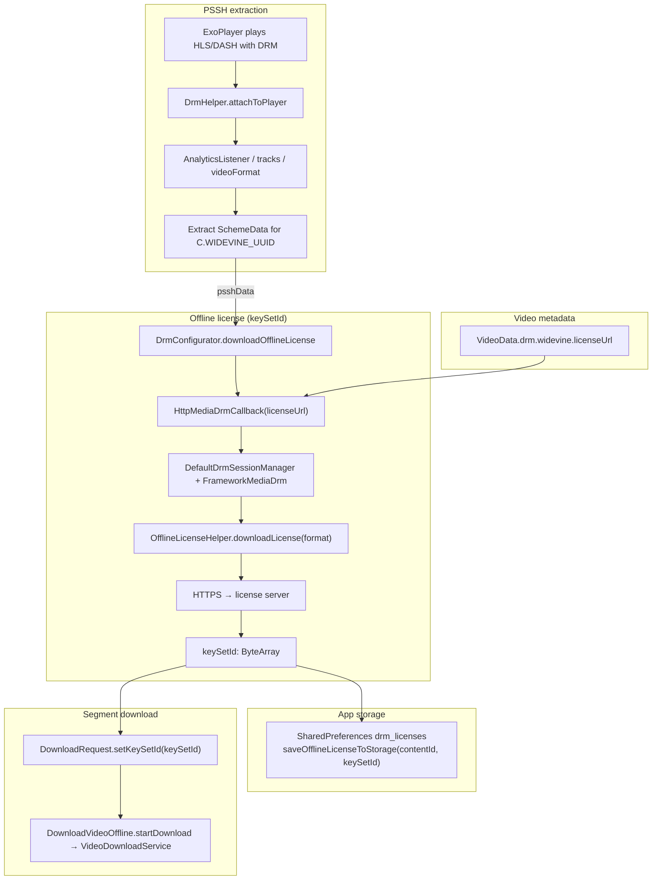
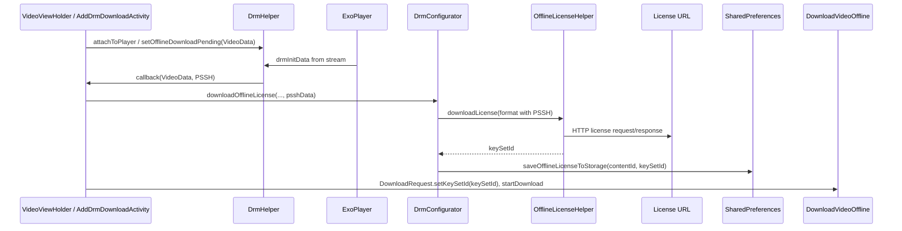

# Offline downloads

The library includes an offline download pipeline: `VideoDownloadService` (declared in the library manifest) and [`DownloadVideoOffline`](../kotlin-kinescope-player/src/main/java/io/kinescope/sdk/download/DownloadVideoOffline.kt) as the entry point.

## Basic flow

1. Initialize at app startup: `DownloadVideoOffline.initialize(context)`
2. Prefer [Quality selection](#quality-selection) so only one height is cached. A bare master-playlist `DownloadRequest` **without** stream keys downloads **all** variants.
3. For **DASH**: use `MimeTypes.APPLICATION_MPD` and the `.mpd` manifest URI with the same helpers.
4. Subscribe to changes: `DownloadVideoOffline.addDownloadListener(context, listener)`; in `onDestroy` call `removeDownloadListener(listener)`.
5. Playback: `download.request.toMediaItem()` + `DownloadVideoOffline.getDownloadCache(context)` with `CacheDataSource`; for DRM set `setDrmKeySetId`. For DASH use `DashMediaSource` with the same cache and keySetId. Offline `CacheDataSource` must use `upstream = null` and **must not** set `FLAG_IGNORE_CACHE_ON_ERROR`.

## Download cache

The download `SimpleCache` must use **`NoOpCacheEvictor`** (Media3 requirement for `DownloadManager`). An LRU size cap (e.g. 300 MB) deletes spans mid-download — progress appears to roll back — and can mark a download completed while segments are missing (intermittent Source error on open). Soft UI quotas are fine; automatic eviction of download spans is not.

## Quality selection

By default a bare `DownloadRequest` on a master playlist downloads **all** variants.
To download a **single** quality, list heights then build a filtered request:

```kotlin
DownloadVideoOffline.listDownloadQualities(
    context,
    hlsUri,
    qualityMap = listOf(
        OfflineDownloadQualityHelper.QualityMapHint(height = 720, name = "720p"),
        // from embed JSON quality_map — labels use height / short side / digits in name
    ),
) { result ->
    result.onSuccess { qualities ->
        val chosen = qualities.first() // or show a picker (labels from quality_map.name)
        DownloadVideoOffline.startDownloadWithQuality(
            context = context,
            contentId = contentId,
            manifestUri = hlsUri,
            videoHeightPx = chosen.height,
            data = metadata,
            keySetId = keySetId, // optional DRM
        )
    }
}
```

Low-level API: [`OfflineDownloadQualityHelper`](../kotlin-kinescope-shorts/library/src/main/java/io/kinescope/sdk/shorts/download/OfflineDownloadQualityHelper.kt)
(Media3 `DownloadHelper` + stream keys).

Offline playback must use `download.request.toMediaItem()` so `streamKeys` match the cached tracks.

## DRM offline keys flow (Widevine)

Offline keys are obtained via **Media3 `OfflineLicenseHelper`** and **Widevine CDM**. The app stores a **`keySetId`** (offline license identifier) and passes it to **`DownloadRequest`**.





| Step | Where in the project |
|------|----------------------|
| License URL | `videoData.drm?.widevine?.licenseUrl` → `HttpMediaDrmCallback` in [`DrmConfigurator`](../kotlin-kinescope-shorts/library/src/main/java/io/kinescope/sdk/shorts/drm/DrmConfigurator.kt) |
| PSSH | [`DrmHelper`](../kotlin-kinescope-shorts/library/src/main/java/io/kinescope/sdk/shorts/drm/DrmHelper.kt) parses `DrmInitData` for `C.WIDEVINE_UUID` |
| Offline license request | `OfflineLicenseHelper.downloadLicense(format)` with `Format` containing `DrmInitData(SchemeData(WIDEVINE, psshData))` |
| Offline identifier | `keySetId` — CDM offline license; passed to `DownloadRequest` |
| Disk backup | `DrmConfigurator.saveOfflineLicenseToStorage` — stores `keySetId` in SharedPreferences by `contentId` |
| Start file download | `DownloadVideoOffline.startDownload` → `VideoDownloadService` |

## DRM download example

```kotlin
drmHelper.attachToPlayer(exoPlayer, videoData) { data, pssh ->
    drmConfigurator.downloadOfflineLicense(context, data, pssh) { keySetId ->
        val request = DownloadRequest.Builder(contentId, manifestUri)
            .setMimeType(MimeTypes.APPLICATION_M3U8)
            .setKeySetId(keySetId)
            .build()
        DownloadVideoOffline.startDownload(context, request)
    }
}
```

The app receives **`keySetId`** after a CDM exchange with the license server; playback and decryption are handled inside Widevine.
